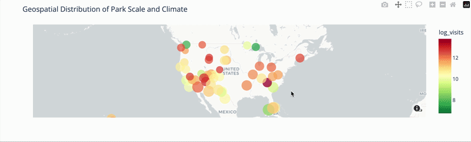

# National Park Crowd & Traffic Optimization Dashboard

Visit the [DEPLOYED APP DEMO](https://nationalparkcrowdpredictor.streamlit.app/)

  

##  The Business Problem

##  Model Architecture & Pipeline Design

## Core Engineering Insights & Visual Audits

### 1. Model Selection: Random Forest vs. XGBoost
While both algorithms tied with a high **92% overall accuracy**, a rigorous **Probability Calibration Evaluation** using Reliability Diagrams and **Brier Scores** revealed a critical structural difference. 

XGBoost demonstrated a hesitant "S-Curve" (underconfidence in mid-range predictions). Random Forest's voting architecture closely hugged the perfect calibration diagonal across all probability thresholds. This ensures that the "Confidence Meter" displayed on the Streamlit user interface is mathematically trustworthy for real-world decision-making.

*👉 [INSERT YOUR PROBABILITY CALIBRATION PLOT HERE]*

### 2. Operational Wins (Error Delta Matrix)
Instead of looking at raw counts, subtracting the baseline matrix from the model matrix isolates the exact operational wins. The model successfully caught critical **"Extreme" traffic days** that historical lookbacks missed entirely, protecting park staff from being caught under-prepared.

*👉 [INSERT YOUR ERROR DELTA HEATMAP HERE]*

### 3. Feature Importance
An audit of feature importances reveals that the model heavily prioritizes rolling calendar history and localized weather physics over static geography markers, validating that the network is truly learning attendance behavior.

*👉 [INSERT YOUR FEATURE IMPORTANCE COMPARISON PLOT HERE]*

  

