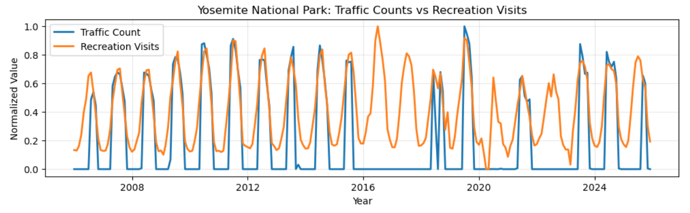
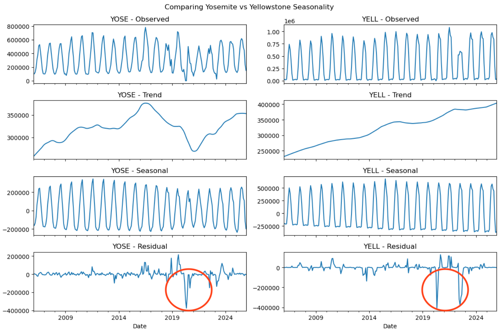
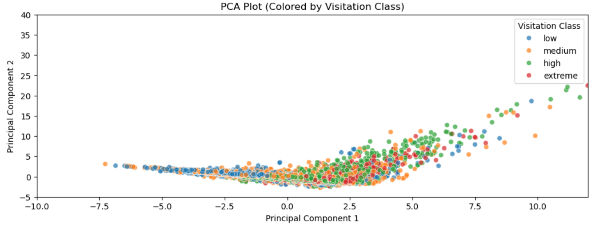
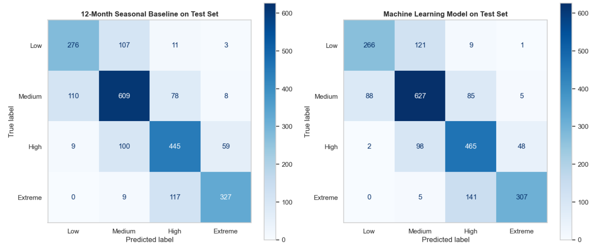
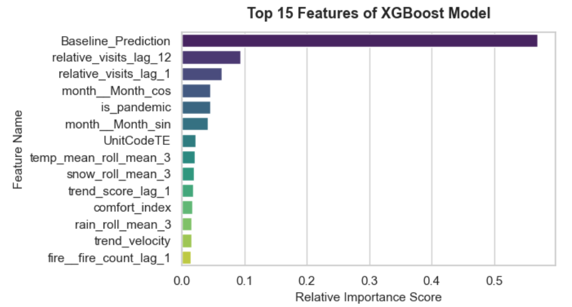
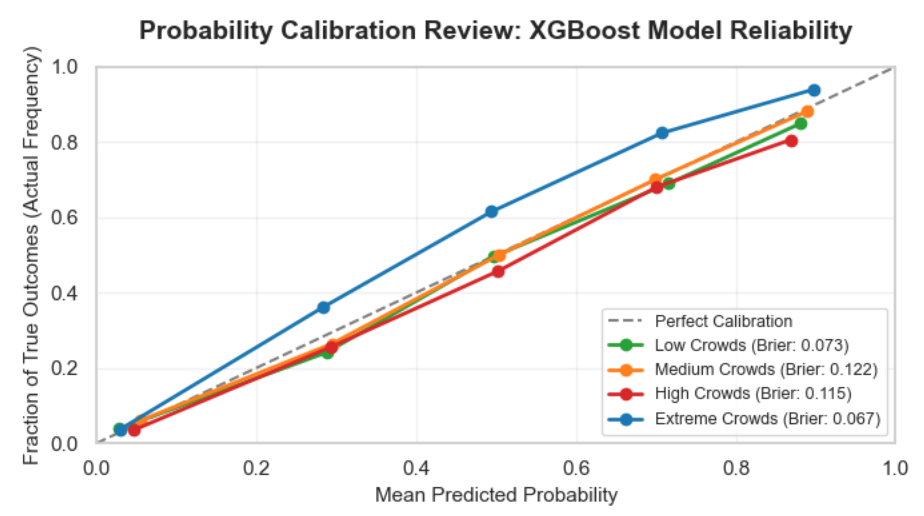

# National Park Crowd & Traffic Optimization Dashboard

A machine learning dashboard that predicts monthly crowd levels across the 63 U.S. National Parks and helps travelers identify lower-congestion times to visit.

  
   
  <em>I took this sunrise photo in Grand Teton National Park in August 2020.</em>

## Project Preview
Explore the deployed application, review the full analysis notebook, or watch a short walkthrough of the application.

  
  &nbsp;
  

https://github.com/user-attachments/assets/01ffd0d1-3bf5-4952-9e7d-18c1cf903818

## Project Motivation

As an avid National Park fan who has visited 25 of the 63 U.S. National Parks, I have experienced firsthand how high visitation levels can impact the park experience through 1+ hour entrance station wait times, full campgrounds, crowded parking lots, and congested trails.

This inspired me to explore whether machine learning could help travelers better plan visits during less congested periods while helping park managers anticipate future demand.

This project builds a machine learning classification model that predicts monthly National Park crowd levels as:

- Low
- Medium
- High
- Extreme

## Data Strategy

The final dataset combines publicly available data from five major domains:

| Data Source | Purpose |
|---|---|
| National Park Service IRMA | Monthly visitation records and traffic counter data |
| Open-Meteo API | Temperature, precipitation, snowfall, and cloud coverage |
| NASA FIRMS | Wildfire activity and intensity |
| Google Trends via PyTrends | Public interest and search activity |
| U.S. Energy Information Administration | Regional fuel prices |

All datasets were merged into a master dataframe using: Park ID x Year x Month key

The final dataset contains:

- 63 National Parks
- 2006-2025 timeframe
- 15,120 monthly observations
- Approximately 30 engineered features

The dataset remains computationally lightweight and can train on a standard laptop while allowing fast deployment through Streamlit.

## Data Engineering

Combining multiple datasets was one of the largest challenges in this project.

### Wildfire Processing

NASA FIRMS contains approximately 3 million wildfire records. To efficiently calculate nearby fire activity, Scikit-Learn's BallTree with the Haversine metric was used.

For each park and month, wildfire features included:

- Fire count within 100km
- Total fire intensity
- Average FRP
- Maximum FRP

### Weather Processing

Daily weather data was aggregated into monthly summaries:

- Average temperature
- Maximum temperature
- Minimum temperature
- Total rainfall
- Total snowfall
- Cloud coverage

### Target Engineering: Per-Park Relative Crowd Tiers

Raw visitation counts are not directly comparable across National Parks because parks vary significantly in size, popularity, and typical visitation patterns. To create meaningful crowd categories, visitation was normalized on a per-park basis.

Each park's historical visitation data was converted into percentile-based crowd tiers:

- Low: 0th–25th percentile
- Medium: 25th–65th percentile
- High: 65th–90th percentile
- Extreme: 90th–100th percentile

To prevent data leakage, percentile thresholds were calculated using only the training period before being applied to validation and test data. This ensured that future visitation patterns were not used when defining the target variable.

### Feature Engineering

Several features were created:

- `is_pandemic` - Identifies 2020-2021 COVID travel disruptions
- `trend_velocity` - Measures changes in public interest over time
- `comfort_index` - Combines temperature and rainfall patterns
- `relative_visits` - Compares visitation against a park's historical average

Additional preprocessing included:

- Custom Scikit-Learn pipeline transformers for feature engineering and preprocessing
- Seasonal missing-value imputation
- Cyclic month encoding
- Park target encoding
- Feature 1-month and 12-month lags
- Rolling averages
- Log transformation of wildfire features to account for skew

## Exploratory Data Analysis

### Target Selection

Traffic counter (blue) and recreation visits (orange) datasets were compared to determine the most reliable visitation target.

Traffic counters frequently contained zeros caused by failures or road closures, making them inconsistent.

Recreation Visits was selected as the final target variable.

  

### Seasonality Analysis

STL decomposition confirmed that National Park visitation is highly seasonal.

The goal of the model is not simply to predict normal seasonal patterns, but to explain deviations caused by:

- Wildfires
- Weather changes
- Economic conditions
- Public interest changes
- Major disruptions such as COVID-19

  

### Feature Analysis

PCA analysis was performed to evaluate whether visitation classes were linearly separable when reduced to 2 dimensions.

The overlapping clusters indicate that crowd levels are influenced by multiple interacting environmental, behavioral, and historical factors. This supported the use of tree-based models such as Random Forest and XGBoost.

  

Feature analysis showed:

Strong predictors:

- Historical visitation patterns
- Search trends
- Temperature patterns
- Seasonal weather

Weaker predictors:

- Gas prices
- Rainfall
- Wildfire activity

### Geographic Distribution Analysis

National Parks vary significantly in visitation volume, climate, and geographic characteristics.

A geospatial analysis was performed to visualize differences in park scale and environmental conditions across the 63 National Parks.

  

## Machine Learning Methodology

The project evaluates several classification models:

1. Logistic Regression
2. Random Forest Classifier
3. XGBoost Classifier

A seasonal baseline model was created using:

> Same month, previous year visitation

This provided a benchmark for measuring whether machine learning improved predictions.

### Training Strategy

To prevent data leakage:

- Data was split chronologically
- Training period: 2006-2022
- Test period: 2023-2025

A rolling window time-series validation strategy was used instead of random splitting.

Additional training techniques:

- Randomized hyperparameter search
- Class weighting for imbalanced crowd tiers

## Model Evaluation

The primary evaluation metric was Weighted F1-score, which accounts for the natural distribution of crowd tiers. Macro F1-score was also tracked to ensure the model performed well on rare but important events such as Extreme crowd levels.

### Cross Validation Results (2006 - 2022)

| Model | Weighted F1 | Macro F1 |
|---|---:|---:|
| Logistic Regression | .675 | .661 |
| Random Forest | .689 | .674 |
| XGBoost | **.692** | **.675** |
| Baseline | .691 | .675 |

XGBoost achieved the strongest cross-validation performance among the machine learning models. 

After evaluating the strong accuracy of the Baseline model, I strategically decided to add the Baseline Tier directly into the feature
set. This approach turns the project into an efficient optimization task to use the baseline as a foundation and then use the remaining features to make adjustments and correct the edge cases.

### Final Test Results (2023-2025)

#### F1 scores
| Model | Weighted F1 | Macro F1 |
|---|---:|---:|
| XGBoost | **.735** | **.731** |
| Baseline | .731 | .729 |

XGBoost improved upon the baseline while maintaining similar Weighted and Macro F1 scores, indicating balanced performance across all crowd tiers.

Evaluation on the 2023-2025 test set confirms that the model generalized well on unseen data. The improvement from approximately 69% during validation to 73.5% on the final test set demonstrates that XGBoost successfully leveraged additional features beyond historical visitation patterns to improve predictions.

#### Confusion Matrix
Although F1 scores are similar between XGBoost and the baseline, confusion matrix analysis reveals the XGBoost model performs way better over the baseline. XGBoost reduced severe prediction errors, particularly cases where extreme crowd periods were incorrectly classified as low or medium demand. This is important because missing high-impact crowd events can directly affect traveler planning and park resource allocation.

  

#### Feature Importance
Feature importance analysis showed that historical crowd patterns were the strongest predictor of future visitation levels.

However, XGBoost used additional environmental and behavioral signals to correct cases where historical patterns alone were insufficient.

Key insights:

- Baseline crowd tier was the strongest predictor
- Weather and public interest features helped identify deviations from historical patterns
- Random Forest showed signs of overfitting by relying more heavily on individual feature patterns

  

#### Probability Calibration
Because the Streamlit application displays prediction probabilities as a user-facing confidence score, model calibration was evaluated using reliability diagrams and Brier scores.

A calibrated model should produce probabilities that match observed outcomes. For example, predictions made with 80% confidence should be correct approximately 80% of the time.

The final XGBoost model produced reliable probability estimates, supporting the use of confidence scores within the application.

  

## Final Model Selection
XGBoost was selected as the final model because it:

- Generalized better on unseen 2023-2025 data
- Reduced severe prediction errors compared to the baseline
- XGBoost used additional weather and interest features to correct edge cases
- Produced more trustworthy probability estimates for the application confidence scores
- Balanced performance across all crowd tiers

## Streamlit Application

The final project was deployed as an interactive Streamlit application that allows users to explore predicted crowd levels across all 63 U.S. National Parks. Users can:

### Explore Crowd Predictions

The interactive map displays predicted monthly crowd levels for each National Park using four crowd tiers:

- Low
- Medium
- High
- Extreme

### Analyze Park Conditions

For a selected park and month, users can view:

- Predicted crowd level
- Prediction confidence score
- Historical visitation trends
- Weather conditions
- Nearby wildfire activity

### Plan Lower-Crowd Visits

When a selected month is predicted to have High or Extreme crowds, the application recommends alternative months with lower expected visitation to help travelers plan less congested trips.

## Future Improvements

Potential improvements include:

- Daily crowd forecasting
- Real-time weather integration
- Park capacity estimation
- Expansion to state parks
- Additional public interest signals such as remoteness

